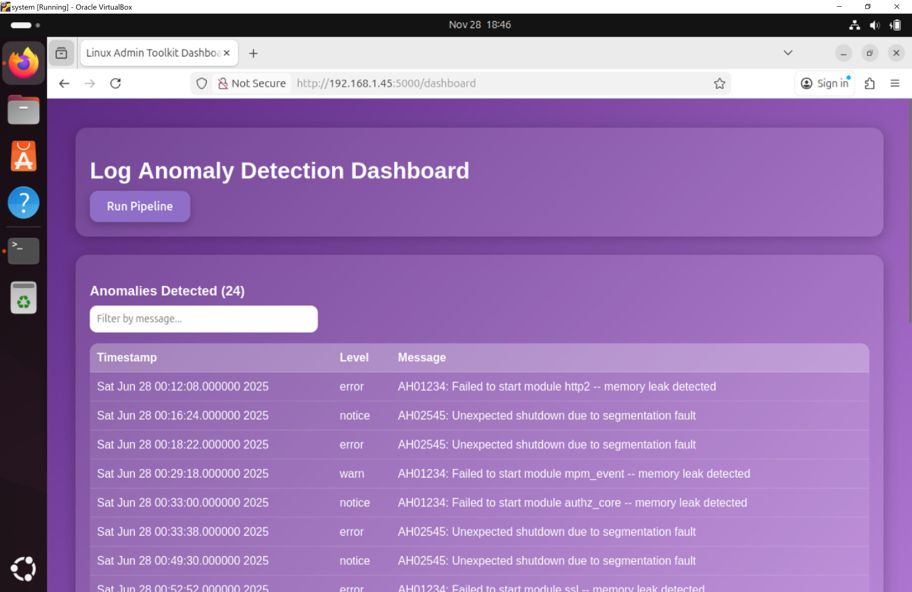
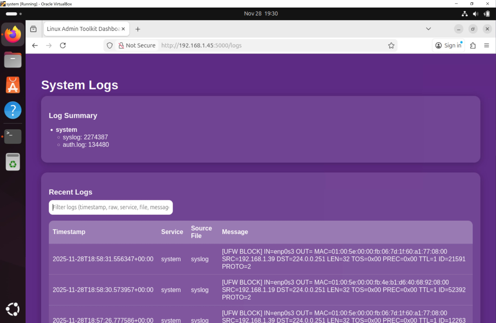

#  🛠️ SystemAdmin Toolkit - Log Anomaly Detection Dashboard

## 1. Project Overview  🌐
The **SystemAdmin Toolkit** is a web-based dashboard that allows system administrators and cybersecurity professionals to monitor server logs for anomalies.  
This project leverages **LogAI** to parse, vectorize, and analyze log data, detecting abnormal events that may indicate system misconfigurations, errors, or potential security threats.


**Key Features:**
- Parses Ubuntu Apache `error.log` files.
- Applies feature extraction and anomaly detection.
- Displays anomaly results in a simple dashboard.
- Displays collected and parsed system logs in a dashboard.

---

## 2. Project Relevance 🔍
Analyzing system logs for anomalies is crucial in **cybersecurity** and **forensics**:
- Detect unauthorized access attempts, software failures, and configuration errors.
- Early detection of suspicious activities can prevent data breaches.
- Helps IT teams maintain server reliability and compliance.
- Straight forward deployment.

**Why this project?**
- I have spent a much larger portion of my life on reading through logs through CLI then I would've liked.
    - This project creates an easier way to interpret the logs and apply anomaly detection to apache2 error logs
- Provides hands-on experience with log preprocessing, feature extraction, and anomaly detection.
- Explores the application of machine learning in real-world system monitoring. 
- Develops skills in Python, Flask, Pandas, and modern UI design.

---

## 3. Methodology ⚙️

### Big Picture Architecture 
The project is a flask application that has two backends runnings. The first being the pipeline for collecting system logs, which then gets inserted into the sqlite3 database. The other backend is the ML logai backend found in the anomaly module. The picture below depicts the architecture.  
<div align="center">
    
</div>

### Setup & Environment
- Follow the steps below to set up environment 

```
# Create virtual environment
sudo apt install git python3 apache2 python3.12-venv
# inside repo systemadmin-toolkit/
python -m venv venv
source venv/bin/activate  # Linux/macOS
venv\Scripts\activate     # Windows

# Install dependencies
pip install -r requirements.txt
```

- Run set up script 
```sudo . setup/start-daemon.sh```
    - This will create a symlink with the Service in setup to /etc/systemd/system/ and will activate start the logpipeline service
    - Enable the Service 
    - Start the Service
    - Checks Service status

### Anomaly Pipeline Steps 🚦
1. Load log data 
2. Preprocess logs (Logai preprocessor)
3. Parse fields using Regex 
4. Vectorize log messages (TF-IDF)
5. Encode categorical attributes 
6. Convert timestamp to datetime 
7. Feature extraction 
8. Train anomaly detector using Isolation Forest 
9. Predict anomalies

---

## 4. Results 📊
Using the syn_gen python script, it generated 6000 logs where about 10 percent are "anomalies." After the Logai Pipeline, the results are as follows:

```Total lines loaded: 6000
First 5 parsed loglines:
                         timestamp     module   level   pid              tid                                            message
0  Sat Jun 28 00:00:00.000000 2025        ssl   error  3266  117883779910642  AH00558: apache2: Could not reliably determine...
1  Sat Jun 28 00:00:02.000000 2025  mpm_event    warn  2622  176855666962058  AH00163: Apache/2.4.58 (Ubuntu) configured -- ...
2  Sat Jun 28 00:00:04.000000 2025       core  notice  4959  193320150672086  AH00489: Apache/2.4.54 (Ubuntu) configured -- ...
3  Sat Jun 28 00:00:06.000000 2025        ssl   error  2648  133021700208903         AH00094: Command line: '/usr/sbin/apache2'
4  Sat Jun 28 00:00:08.000000 2025       core   error  2581  191859659731135  AH00558: apache2: Could not reliably determine...
Vector shape: (6000,)
Feature vector shape: (6000, 101)
Number of anomalies detected: 24
2025-11-28 14:52:55,030 - INFO - Results:
                              timestamp      module   level   pid              tid                                            message  anomaly
3103  Sat Jun 28 01:43:26.000000 2025       http2  notice  3234  106531649993002  AH01234: Failed to start module http2 -- memor...     True
3610  Sat Jun 28 02:00:20.000000 2025       http2   error  3546  134447859317750  AH02545: Unexpected shutdown due to segmentati...     True
3978  Sat Jun 28 02:12:36.000000 2025        core    warn  3802  101226165193204  AH01234: Failed to start module core -- memory...     True
4145  Sat Jun 28 02:18:10.000000 2025         ssl    warn  1948  194241612839408  AH02545: Unexpected shutdown due to segmentati...     True
4310  Sat Jun 28 02:23:40.000000 2025       http2  notice  4883  175860066769275  AH02545: Unexpected shutdown due to segmentati...     True
4553  Sat Jun 28 02:31:46.000000 2025       http2    warn  1232  100343239428743  AH02545: Unexpected shutdown due to segmentati...     True
4948  Sat Jun 28 02:44:56.000000 2025   mpm_event    warn  4266  181580467931290  AH02545: Unexpected shutdown due to segmentati...     True
4961  Sat Jun 28 02:45:22.000000 2025        core   error  5000  147980618520373  AH01234: Failed to start module core -- memory...     True
4998  Sat Jun 28 02:46:36.000000 2025       http2    warn  2305  185635829427070  AH01234: Failed to start module http2 -- memor...     True
5179  Sat Jun 28 02:52:38.000000 2025  authz_core  notice  4148  198663589477653  AH02545: Unexpected shutdown due to segmentati...     True
5473  Sat Jun 28 03:02:26.000000 2025  authz_core   error  3145  198433622861567  AH01234: Failed to start module authz_core -- ...     True
5944  Sat Jun 28 03:18:08.000000 2025   mpm_event    warn  1281  136108301051810  AH01234: Failed to start module mpm_event -- m...     True
```
### Results seen in Anomaly Dashboard
<div align="center">
    
</div>


### System Logs Parsed Results
<div align="center">
    
</div>

---

## 5. Conclusion & Future Work 🚀

This project highlights the complexity of log analysis and demonstrates the potential of ML-based anomaly detection:

**Key Insights:**

- Isolation Forest is effective for small, structured log datasets.
  - As can be seen in the results the majority of the detected anomalies were "malicious," like segmentation faults.

- Manual log inspection is time-consuming; automation increases efficiency.

- Feature extraction (TF-IDF + categorical encoding) is critical for accurate anomaly detection.

**Lessons Learned:**

- Preprocessing and parsing logs correctly is often more challenging than model training.

- Choosing the right anomaly detection algorithm (e.g., Isolation Forest vs. OneClassSVM) significantly impacts results. With OneClassSVM the similarity of the logs cause false positives.

- Integration of results into a live dashboard improves situational awareness for administrators. 

**Future Work:**

- Expand to multiple log sources (access logs, cron logs, application logs).
  - Skeleton for apache logs is in place for the logpipeline.service but not operational

- Incorporate real-time streaming with WebSockets or Kafka.

- Experiment with more advanced models (e.g., Autoencoders, LSTM-based anomaly detection) for sequential logs.

- Add alerting and notifications for critical anomalies.

- Combine the Pipelines into one.

- Improve UI/UX with more interactive filtering and visualization options.
---

### LICENSE
LogAI License & Attribution

This application uses the LogAI library (https://github.com/salesforce/logai).
All rights to the LogAI software remain with the original authors.

This software is intended for educational purposes only.
It demonstrates the use of LogAI for anomaly detection in log files.
No commercial use of LogAI or its derivatives is intended or authorized by this project.

Credits:
- LogAI Authors: https://github.com/salesforce/logai
- Original LogAI License: [See LogAI repository for full license details]

Educational Use Disclaimer:
This application is not intended for production or commercial deployments.
All anomaly detection results are for demonstration and learning purposes only.